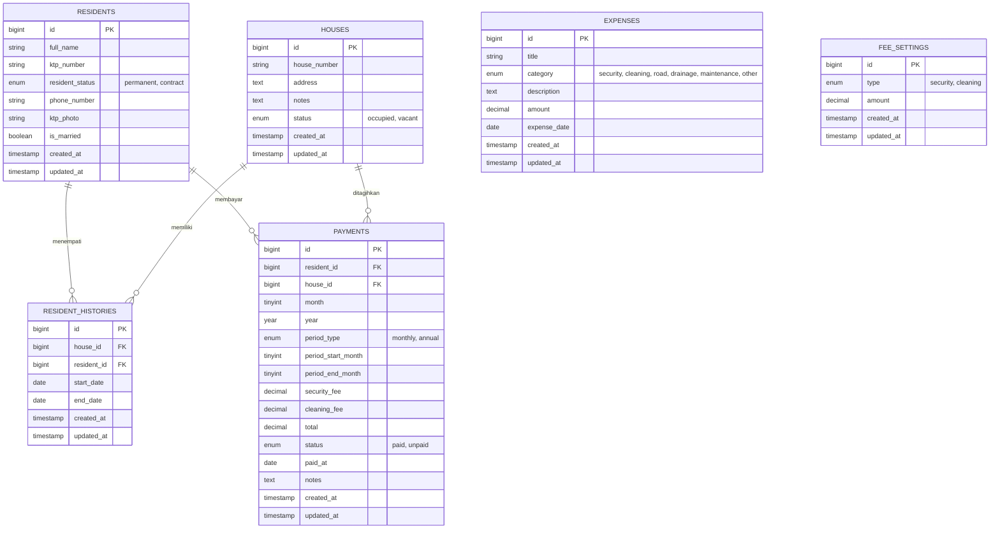

# Sistem Administrasi Iuran RT

Aplikasi full stack untuk membantu RT mengelola data penghuni, rumah, riwayat hunian, pembayaran iuran bulanan, pengeluaran, dan laporan kas lingkungan.

Ketentuan teknologi:

- Backend: Laravel API
- Frontend: React
- DBMS: MySQL
- Docker: tidak digunakan

## Output Submission

Deliverable yang diminta sudah tersedia di repository ini:

1. ERD: lihat bagian [ERD](#erd).
2. Repo Aplikasi: backend ada di folder `server`, frontend ada di folder `client`.
3. Panduan Instalasi: lihat bagian [Panduan Instalasi Lengkap](#panduan-instalasi-lengkap).

## Fitur Utama

- Dashboard ringkasan jumlah rumah, penghuni, rumah dihuni, rumah kosong, pemasukan, pengeluaran, dan saldo.
- Mengelola penghuni: tambah, ubah, hapus, upload foto KTP, status tetap/kontrak, nomor telepon, dan status menikah.
- Mengelola rumah: tambah, ubah, hapus, status dihuni/tidak dihuni, catatan rumah, penghuni aktif, histori hunian, dan histori pembayaran.
- Mengelola riwayat hunian: tambah/ubah penghuni rumah dengan tanggal mulai dan tanggal selesai. Status rumah otomatis berubah berdasarkan penghuni aktif.
- Mengelola pembayaran: tambah pembayaran iuran, generate tagihan bulanan untuk penghuni aktif, status lunas/belum lunas, iuran satpam, iuran kebersihan, pembayaran bulanan atau tahunan.
- Mengelola pengeluaran: catat pengeluaran rutin dan non-rutin seperti gaji satpam, token listrik pos satpam, perbaikan jalan, perbaikan selokan, pemeliharaan, dan lainnya.
- Laporan: summary pemasukan, pengeluaran, saldo, piutang/belum lunas, detail transaksi bulanan, dan grafik 12 bulan.

## Aturan Iuran

Iuran bulanan sesuai study case:

- Iuran satpam: Rp 100.000 per bulan.
- Iuran kebersihan: Rp 15.000 per bulan.

Aturan penghuni:

- Penghuni tetap ditagihkan setiap bulan.
- Rumah kontrak/sementara ditagihkan jika ada penghuni aktif pada periode bulan tersebut.
- Rumah tanpa penghuni aktif tidak dibuatkan tagihan.
- Pembayaran dapat dicatat bulanan atau tahunan. Contoh: kebersihan dapat dibayar 1 tahun, sedangkan satpam biasanya tetap bulanan.

## ERD

ERD berikut dapat dirender langsung oleh GitHub karena menggunakan Mermaid.



## Penjelasan Tabel

| Tabel | Fungsi |
| --- | --- |
| `residents` | Menyimpan data penghuni, termasuk foto KTP, status tetap/kontrak, nomor telepon, dan status menikah. |
| `houses` | Menyimpan data rumah, nomor rumah, alamat, catatan, dan status dihuni/tidak dihuni. |
| `resident_histories` | Menyimpan histori penghuni pada setiap rumah berdasarkan tanggal mulai dan tanggal selesai. |
| `payments` | Menyimpan tagihan/pembayaran iuran satpam dan kebersihan, status lunas/belum lunas, periode, dan rumah terkait. |
| `expenses` | Menyimpan pengeluaran RT, baik rutin maupun non-rutin. |
| `fee_settings` | Menyimpan nominal default iuran satpam dan kebersihan. |

## Repo Aplikasi

Struktur repository:

```text
RT-Management-System/
|-- README.md
|-- client/                  # Frontend React
|   |-- public/
|   |-- src/
|   |   |-- api/             # Konfigurasi Axios
|   |   |-- components/      # Layout, navbar, sidebar
|   |   |-- pages/           # Dashboard, Penghuni, Rumah, Pembayaran, dll.
|   |   `-- utils/           # Helper format angka, mata uang, label status
|   |-- package.json
|   `-- vite.config.js
`-- server/                  # Backend Laravel API
    |-- app/
    |   |-- Http/
    |   |   |-- Controllers/Api/
    |   |   `-- Requests/
    |   `-- Models/
    |-- database/
    |   |-- migrations/
    |   `-- seeders/
    |-- routes/
    |   `-- api.php
    |-- composer.json
    `-- artisan
```

Endpoint API utama:

| Method | Endpoint | Fungsi |
| --- | --- | --- |
| GET/POST | `/api/residents` | List dan tambah penghuni |
| GET/PUT/DELETE | `/api/residents/{id}` | Detail, ubah, hapus penghuni |
| GET/POST | `/api/houses` | List dan tambah rumah |
| GET/PUT/DELETE | `/api/houses/{id}` | Detail, ubah, hapus rumah |
| GET/POST | `/api/resident-histories` | List dan tambah riwayat hunian |
| GET/PUT/DELETE | `/api/resident-histories/{id}` | Detail, ubah, hapus riwayat hunian |
| GET/POST | `/api/payments` | List dan tambah pembayaran |
| POST | `/api/payments/generate` | Generate tagihan bulanan penghuni aktif |
| GET/PUT/DELETE | `/api/payments/{id}` | Detail, ubah, hapus pembayaran |
| GET/POST | `/api/expenses` | List dan tambah pengeluaran |
| GET/PUT/DELETE | `/api/expenses/{id}` | Detail, ubah, hapus pengeluaran |
| GET | `/api/dashboard` | Ringkasan dashboard |
| GET | `/api/dashboard/chart` | Data grafik dashboard |
| GET | `/api/reports/monthly` | Laporan detail per bulan |
| GET | `/api/reports/yearly` | Laporan grafik 12 bulan |

## Panduan Instalasi Lengkap

Ikuti langkah ini dari awal pada komputer lokal. Jangan menggunakan Docker.

### 1. Prasyarat

Pastikan aplikasi berikut sudah terinstall:

- PHP 8.2 atau lebih baru.
- Composer.
- Node.js 20 atau lebih baru.
- npm.
- MySQL Server.
- Git.

Cek versi:

```bash
php -v
composer -V
node -v
npm -v
mysql --version
git --version
```

### 2. Clone Repository

```bash
git clone <url-repository>
cd RT-Management-System
```

Jika source code diberikan dalam file ZIP, extract file ZIP lalu masuk ke folder `RT-Management-System`.

### 3. Buat Database MySQL

Masuk ke MySQL:

```bash
mysql -u root -p
```

Buat database:

```sql
CREATE DATABASE rt_management CHARACTER SET utf8mb4 COLLATE utf8mb4_unicode_ci;
EXIT;
```

Jika user MySQL tidak memakai password, cukup tekan Enter saat diminta password.

### 4. Install Backend Laravel

Masuk ke folder backend:

```bash
cd server
composer install
```

Copy file environment:

```bash
cp .env.example .env
```

Untuk Windows PowerShell, gunakan:

```powershell
Copy-Item .env.example .env
```

Generate app key:

```bash
php artisan key:generate
```

Ubah konfigurasi database di file `server/.env`:

```env
APP_NAME="RT Management System"
APP_ENV=local
APP_DEBUG=true
APP_URL=http://127.0.0.1:8000

DB_CONNECTION=mysql
DB_HOST=127.0.0.1
DB_PORT=3306
DB_DATABASE=rt_management
DB_USERNAME=root
DB_PASSWORD=
```

Jika MySQL lokal memakai password, isi `DB_PASSWORD` sesuai password MySQL.

Pastikan filesystem publik aktif agar upload foto KTP dapat diakses:

```bash
php artisan storage:link
```

Jalankan migration dan seeder:

```bash
php artisan migrate --seed
```

Seeder akan membuat data contoh:

- 20 rumah sesuai study case.
- 15 rumah penghuni tetap.
- Beberapa rumah kontrak/sementara.
- Contoh tagihan bulanan.
- Contoh pembayaran tahunan.
- Contoh pengeluaran rutin dan non-rutin.

Jalankan backend:

```bash
php artisan serve --host=127.0.0.1 --port=8000
```

Backend berjalan di:

```text
http://127.0.0.1:8000
```

Cek API backend:

```text
http://127.0.0.1:8000/api/dashboard
```

### 5. Install Frontend React

Buka terminal baru dari root project, lalu jalankan:

```bash
cd client
npm install
```

Konfigurasi API frontend berada di `client/src/api/axios.js`:

```js
baseURL: "http://127.0.0.1:8000/api"
```

Pastikan URL tersebut sama dengan URL backend Laravel.

Jalankan frontend:

```bash
npm run dev -- --host 127.0.0.1 --port 5173
```

Frontend berjalan di:

```text
http://127.0.0.1:5173
```

Jika port `5173` sudah dipakai, Vite akan menampilkan port lain di terminal. Buka URL yang muncul di terminal tersebut.

### 6. Urutan Menjalankan Aplikasi

Gunakan dua terminal:

Terminal 1 untuk backend:

```bash
cd server
php artisan serve --host=127.0.0.1 --port=8000
```

Terminal 2 untuk frontend:

```bash
cd client
npm run dev -- --host 127.0.0.1 --port 5173
```

Buka browser:

```text
http://127.0.0.1:5173
```

## Cara Pakai Singkat

1. Buka `http://127.0.0.1:5173`.
2. Buka menu Penghuni untuk menambah atau mengubah data warga.
3. Buka menu Rumah untuk menambah atau mengubah data rumah.
4. Buka menu Riwayat Hunian untuk menetapkan penghuni pada rumah tertentu.
5. Buka menu Pembayaran untuk membuat atau mengubah pembayaran iuran.
6. Klik generate tagihan bulanan di halaman Pembayaran untuk membuat tagihan penghuni aktif.
7. Ubah status pembayaran menjadi Lunas saat warga membayar.
8. Buka menu Pengeluaran untuk mencatat pengeluaran rutin/non-rutin.
9. Buka menu Laporan untuk melihat detail bulanan dan grafik 12 bulan.

## Build Production

Backend Laravel:

```bash
cd server
php artisan config:cache
php artisan route:cache
```

Frontend React:

```bash
cd client
npm run build
```

Hasil build frontend berada di:

```text
client/dist
```

## Verifikasi

Perintah yang digunakan untuk mengecek aplikasi:

Backend:

```bash
cd server
php artisan test
php artisan route:list --path=api
```

Frontend:

```bash
cd client
npm run lint
npm run build
```

Hasil verifikasi terakhir:

- `php artisan test`: passed.
- `npm run lint`: passed.
- `npm run build`: passed.

## Troubleshooting

Jika `php artisan migrate --seed` gagal karena database belum dibuat:

```sql
CREATE DATABASE rt_management CHARACTER SET utf8mb4 COLLATE utf8mb4_unicode_ci;
```

Jika konfigurasi database berubah tetapi Laravel masih membaca konfigurasi lama:

```bash
cd server
php artisan config:clear
php artisan cache:clear
```

Jika foto KTP tidak tampil setelah upload:

```bash
cd server
php artisan storage:link
```

Pastikan `APP_URL` di `server/.env` adalah:

```env
APP_URL=http://127.0.0.1:8000
```

Jika frontend tidak bisa mengambil data API:

- Pastikan backend aktif di `http://127.0.0.1:8000`.
- Pastikan `client/src/api/axios.js` memakai `baseURL: "http://127.0.0.1:8000/api"`.
- Buka `http://127.0.0.1:8000/api/dashboard` untuk memastikan API merespons.

Jika ingin reset database dan mengisi ulang data contoh dari awal:

```bash
cd server
php artisan migrate:fresh --seed
```

Perintah tersebut akan menghapus seluruh tabel dan data lama, lalu membuat ulang tabel serta data seed.

## Screenshot Fitur untuk Submission

Ambil screenshot dari halaman berikut setelah frontend dan backend berjalan:

- Dashboard: ringkasan rumah, penghuni, pemasukan, pengeluaran, saldo, dan grafik.
- Penghuni: tabel penghuni dan form tambah/ubah penghuni dengan foto KTP.
- Rumah: status rumah, penghuni aktif, histori hunian, dan histori pembayaran.
- Riwayat Hunian: tabel histori penghuni per rumah.
- Pembayaran: tagihan bulanan, pembayaran tahunan kebersihan, status lunas/belum lunas.
- Pengeluaran: daftar pengeluaran dan form tambah/ubah.
- Laporan: ringkasan bulanan, detail pemasukan, detail pengeluaran, dan grafik 12 bulan.
